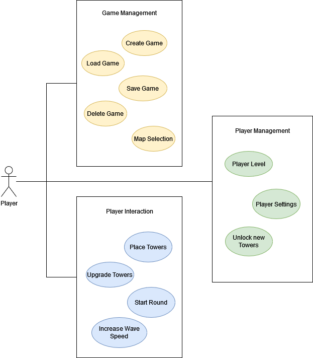
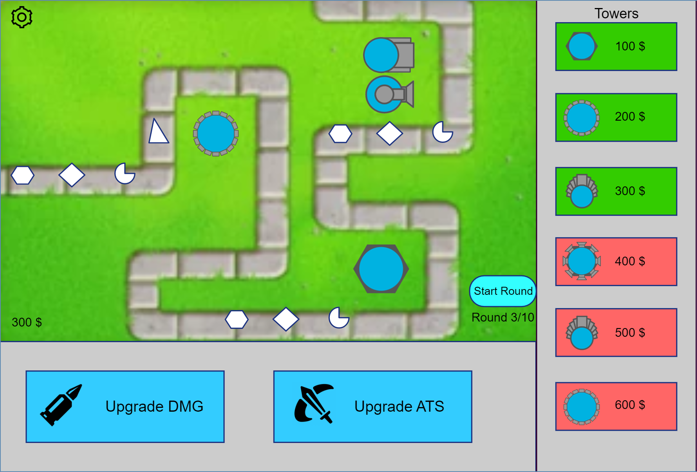

TowerDefense - Software Requirements Specification 

## Table of contents
- [Table of contents](#table-of-contents)
- [Introduction](#1-introduction)
    - [Purpose](#11-purpose)
    - [Scope](#12-scope)
    - [Definitions, Acronyms and Abbreviations](#13-definitions-acronyms-and-abbreviations)
    - [References](#14-references)
    - [Overview](#15-overview)
- [Overall Description](#2-overall-description)
    - [Vision](#21-vision)
    - [Use Case Diagram](#22-use-case-diagram)
	- [Technology Stack](#23-technology-stack)
- [Specific Requirements](#3-specific-requirements)
    - [Functionality](#31-functionality)
    - [Usability](#32-usability)
- [Supporting Information](#4-supporting-information)

## 1. Introduction

### 1.1 Purpose
This Software Requirements Specification (SRS) describes all specifications for the application "Tower Defense". It includes an overview about this project and its vision, detailed information about the planned features and boundary conditions of the development process.

### 1.2 Scope
We are going to create a simple Tower Defense game that runs on Android Phones
When you open the application you are presented with a menu where you can choose between a Start, Load, Quit and Settings Button.
If you start or load the game you get forwarded to the game map.

The map should be split in 2 Parts:

    - The way through the map where enemies walk to your base to decrease your HP
    - A place where you can place your turrets to defend your base!

The main goal is to survive multiple waves of enemies which can be achieved by buying and upgrading towers.
This towers can then be placed on the map and automatically shoot the enemies walking along the path

### 1.3 Definitions, Acronyms and Abbreviations
| Abbrevation | Explanation                            |
| ----------- | -------------------------------------- |
| SRS         | Software Requirements Specification    |
| UC          | Use Case                               |
| n/a         | not applicable                         |
| tbd         | to be determined                       |
| UCD         | overall Use Case Diagram               |
| FAQ         | Frequently asked Questions             |

### 1.4 References

| Title                                                              | Date       | Publishing organization   |
| -------------------------------------------------------------------|:----------:| ------------------------- |
| [TowerDefense Blog](https://github.com/argastle/TowerDefense/discussions)   | 20.10.2022 | TowerDefense Team    |
| [GitHub](https://github.com/argastle/TowerDefense)              | 20.10.2022 | TowerDefense Team    |

### 1.5 Overview
The following chapter provides an overview of this project with vision and Overall Use Case Diagram. The third chapter (Requirements Specification) delivers more details about the specific requirements in terms of functionality, usability and design parameters. Finally there is a chapter with supporting information. 
    
## 2. Overall Description

### 2.1 Vision
Inspired by games like Bloons TD we want to make a unique take on the Tower Defense genre. To achieve that we create our own individual design for the map, towers and enemies. Additionally we try to add new features which popular Tower Defense games haven't implemented yet. But the most important thing is that our game is entertaining and fun to play!

### 2.2 Use Case Diagram

### 2.3 Technology Stack
The technology we use is:

Game Engine:
- Unity

IDE:
- Unity Hub
- Rider
- Visual Studio Code

Project Management:
- YouTrack
- GitHub

## 3. Specific Requirements

### 3.1 Functionality
This section will explain the different use cases, you could see in the Use Case Diagram, and their functionality.  
Until December we plan to implement:
- 3.1.1 Create Game
- 3.1.2 Start Round
- 3.1.3 Place Towers
- 3.1.4 Upgrade Towers

Until June, we want to implement:
- 3.1.5 Increase Wave Speed
- 3.1.6 Save Game
- 3.1.7 Load Game
- 3.1.8 Player Level
- 3.1.9 Unlock new Towers
- 3.1.10 Player Settings

#### 3.1.1 Create Game
This feature is the essential one of our project. The user gets the possibility to post a session. Therefore, they have to select a game and also set the time when they want to play.For offline games, they have to set a location, too. For online games the location can be a server for example or simply be tagged as 'online'.

[Create Game](./UseCases/Create_Game.md)

#### 3.1.2 Start Round
This feature provides a basic overview over all current sessions. All posted sessions are added here. From this overview you can select a session and from there join this session.

[Start Round](./UseCases/Start_Round.md)

#### 3.1.3 Place Towers
To identify all useres we need an account system. This account system enables us to build important functions such as joining a session, leaving a session or a personalized overview over all sessions (Keeping track of your sessions).

[Place Towers](./UseCases/Place_Towers.md)

#### 3.1.4 Upgrade Towers
The app will provide the possibility to register and log in. This will also make the usability easier when a user wants to manage his sessions, post or join a session because they don't have to enter their mail address every time.

[Upgrade Towers](./UseCases/Upgrade_Towers.md)

#### 3.1.5 Increase Wave Speed
In case you share your phone, have multiple accounts or just want to be cautius about your privacy you should be able to manually log out.

#### 3.1.6 Save Game
There is also the possibility to join an existing game session. Therefore, the user can select a specific session.

#### 3.1.7 Load Game
The app provides the user with a seperate page view where they get an overview of all sessions they posted or joined. When the user clicks on a session, he can also see who joined his posted sessions.

#### 3.1.8 Player Level
Based on the overview over all sessions this features enables the user to find sessions by specific parameters. Therefore, the user can find a session by tags or other parameters like date. Later on, finding a session will be provided by geolocalization that the users can search for a session in a specific area.

#### 3.1.9 Unlock new Towers
There must be the possibility that two people who want to play together can communicate with each other. The player who joins the session gets the possibility to contact the owner and vice versa. Later on, when we will have implemented profiles, then they will form another way to communicate with each other.

#### 3.1.10 Player Settings
With the possibility to log in there comes another functionality, the profile. Every user will have their own profile where they can write some informations about themselves. Because of the privacy policy in Europe, the user has the possibility to only write the information they want other people to see. Using the profile, users can also check out other players and learn e.g. their favorite games.

### 3.2 Usability
We plan on designing the user interface as intuitive and self-explanatory as possible to make the user feel as comfortable as possible using the app. Though an FAQ document will be available, it should not be necessary to use it.

## 4. Supporting Information
For any further information you can contact the TowerDefense Team or check our [TowerDefense Blog](https://github.com/argastle/TowerDefense/discussions). 
The Team Members are:
- Paul Faller
- Lukas Weber
- Tim Wäckerle
- Nico Argast
- Johannes Methfessel

<!-- Picture-Link definitions: -->
[OUCD]: https://github.com/IB-KA/CommonPlayground/blob/master/UseCaseDiagramCP.png "Overall Use Case Diagram"
