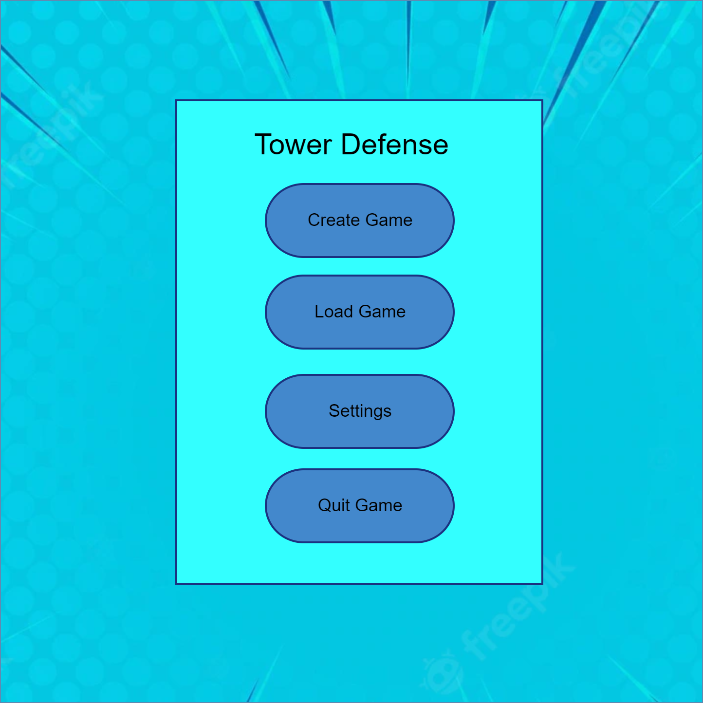

# Use-Case Specification: Start Game

# 1. Start Game

## 1.1 Brief Description

This use case allows users to start a game. He can either create a new game or load an existing one. This is neccecary for playing the game, since you can't play without an existing game. 

## 1.2 Mockup 

# 2. Flow of events

## 2.1. Basic Flow

- User clicks on create new game
- a new game is started

## 2.2 Advanced Flow

- User clicks on load game
- a new menu opens up where he can choose which game he wants to load

# 3. Special Requirements
n/a

# 4. Preconditions
The preconditions for this use case are:
1. The user has started the App

# 5. Postconditions
The postconditions for this use case are:
1. A new game is created
2. An already existing game is loaded

