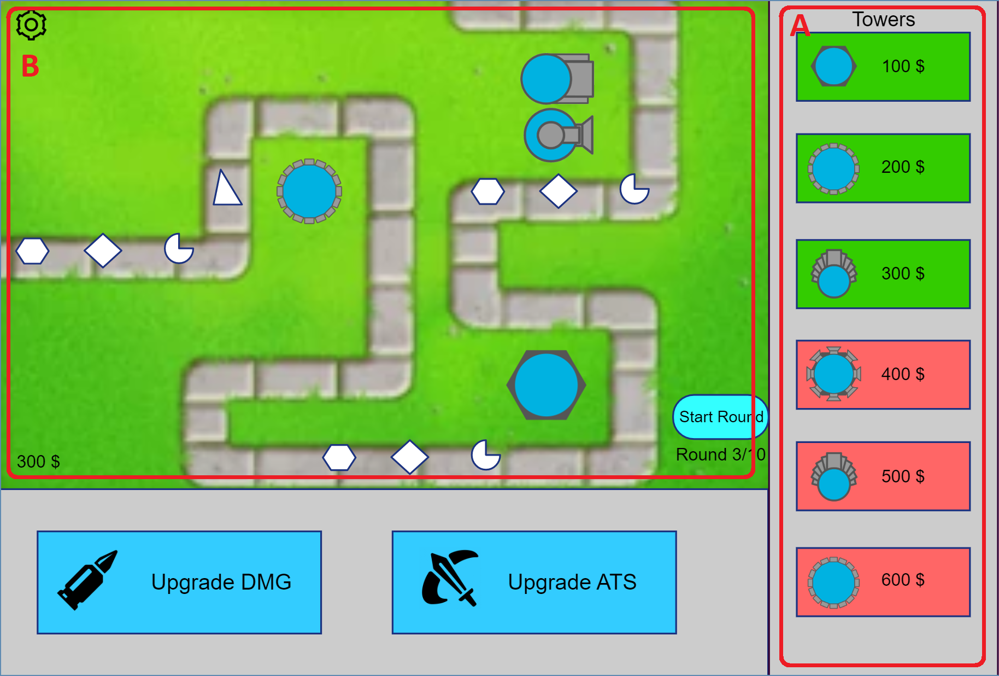

# Use-Case Specification: Place Towers

# 1. Place Towers

## 1.1 Brief Description
This use case allows players to place towers on the map.
The player can choose on from a verarity of different towers and place it anywere on the grid. 
This is important as it is the essential functionality for the game.

## 1.2 Mockup 

# 2. Flow of Events

## 2.1 Basic Flow
- Users select a tower by selecting it on (A)
- Users can place the selected tower on the map (B)
- The cost for the tower is removed from the players money

## 2.2 Alternative Flows
- The user doesn't have enought money, so no tower can be placed

# 3. Special Requirements
n/a

# 4. Preconditions
The preconditions for this use case are:
1. The player has enough money

# 5. Postconditions
The postconditions for this use case are:
n/a

# 6. Story Points

Total number of story points: 11
