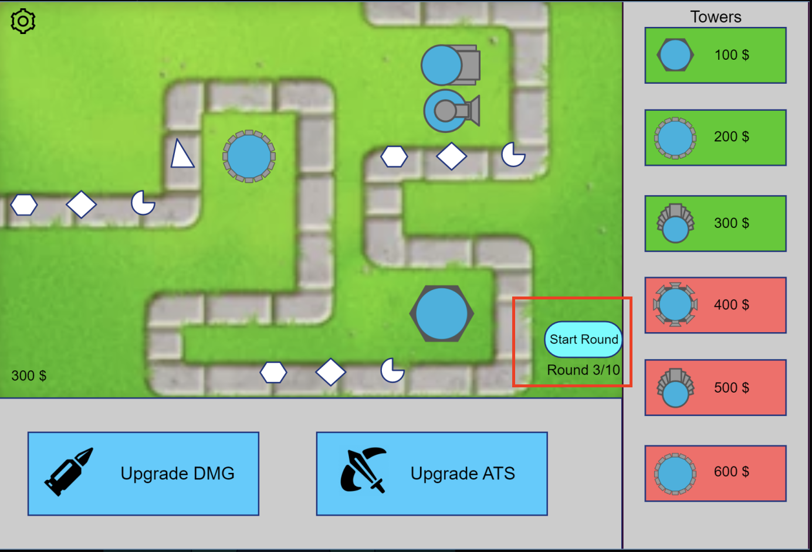

# Use-Case Specification: Start Round

# 1. Start Round

## 1.1 Brief Description
This use case allows players to start a new round while playing the game. 
This is a necessary feature for the game since the game pauses after every wave. 
So the player can decide when he is ready for the next wave.

## 1.2 Mockup 

# 2. Flow of Events

## 2.1 Basic Flow
- Users klicks on "Start next Round"

## 2.2 Alternative Flows
- User enables the auto-start setting, so the new rounds starts automatically

# 3. Special Requirements
n/a

# 4. Preconditions
The preconditions for this use case are:
1. The player has started a game

# 5. Postconditions
The postconditions for this use case are:
1. The next round starts
2. The round counter is refreshed

# 6. Story Points
Total number of story points: 5
